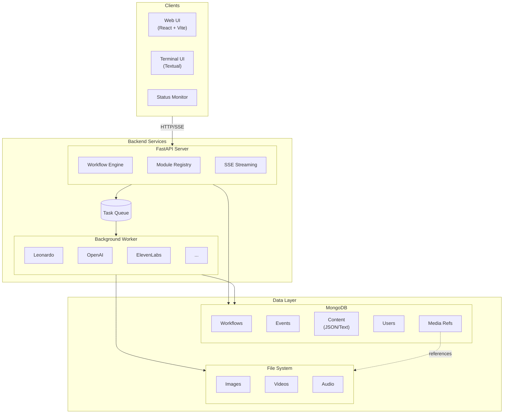
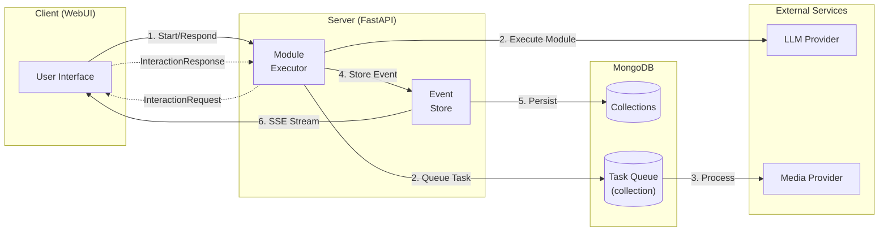
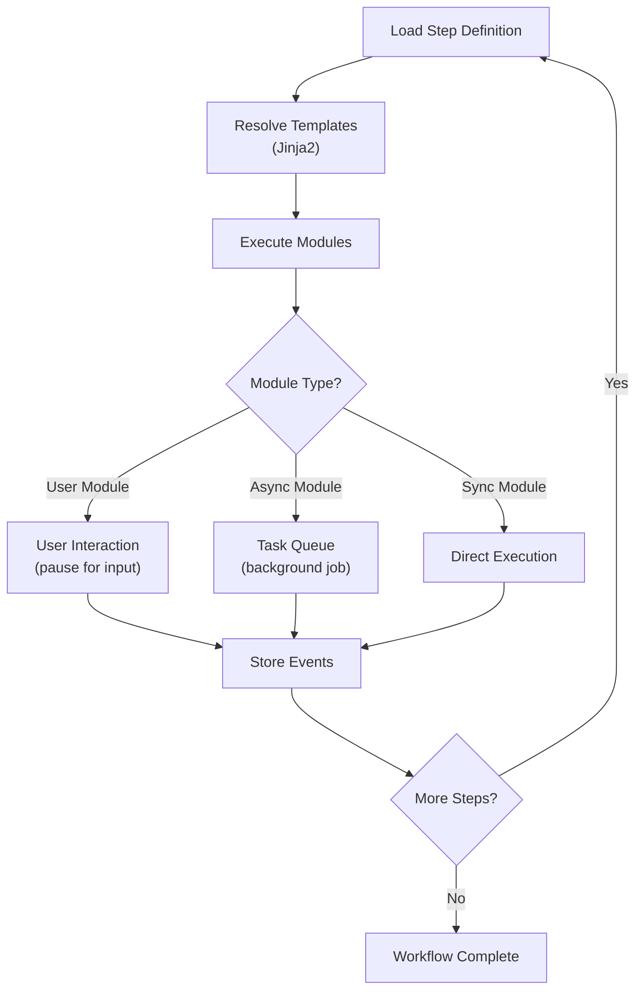
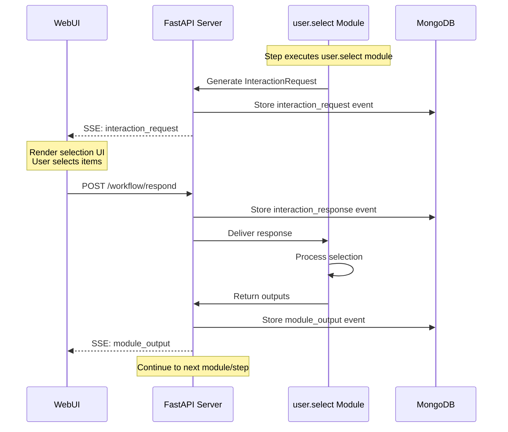
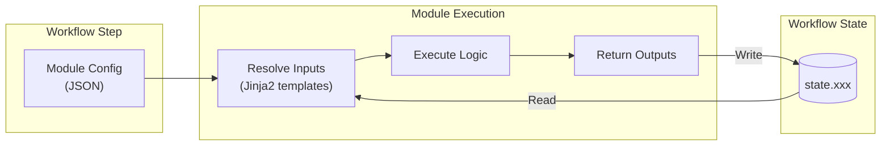

# Workflow Manager

A modular, event-sourced workflow execution platform for AI-powered content
generation. Built with FastAPI, React, and MongoDB.

## Tech Stack

| Layer | Technology |
|-------|------------|
| Backend | Python 3.10+, FastAPI, Pydantic |
| Frontend | React 19, TypeScript, Vite, TailwindCSS 4 |
| Database | MongoDB (event-sourced state) |
| UI Components | Radix UI, shadcn/ui |
| State Management | Zustand |
| Templating | Jinja2 (Python), Nunjucks (JS) |
| Task Queue | Custom MongoDB-based async queue |
| Terminal UI | Textual, Rich |
| Deployment | Docker, Docker Compose, Nginx |

### AI Provider Integrations

- **LLM**: OpenAI (GPT-4o, o1, o3), Anthropic (Claude)
- **Image Generation**: Leonardo.ai, OpenAI DALL-E, Stable Diffusion, MidJourney
- **Audio/Speech**: ElevenLabs

## Architecture



## Project Structure

```
workflowmanager/
├── backend/                    # Python backend
│   ├── server/                 # FastAPI workflow server
│   │   ├── api/                # REST API routes
│   │   ├── engine/             # Workflow execution engine
│   │   ├── modules/            # Pluggable workflow modules
│   │   └── workflow/           # Workflow processing logic
│   ├── worker/                 # Background task processor
│   ├── db/                     # Database layer (repositories, migrations)
│   └── providers/              # External service integrations
│       └── media/              # Media generation providers
├── contracts/                  # Shared Python interfaces/DTOs
├── ui/                         # Frontend packages
│   ├── shared/                 # @wfm/shared - React component library
│   ├── webui/                  # Web-based workflow UI
│   ├── tui/                    # Terminal-based workflow UI
│   └── status/                 # Status monitoring server
├── workflows/                  # Workflow definitions (JSON)
├── scripts/                    # Utility and migration scripts
└── deploy/                     # Docker deployment configuration
```

## Packages

### Backend (Python)

The backend is split into focused packages that can be deployed independently.
Server handles HTTP/SSE, worker processes async jobs, and both share the
database layer.

#### `backend/server` - Workflow Server

The main entry point for workflow execution. Receives requests from clients,
loads workflow definitions, resolves Jinja2 templates, executes modules in
sequence, and streams events back via SSE. Handles user interactions by
pausing execution until responses arrive.

- RESTful API with Pydantic validation
- Server-Sent Events (SSE) for real-time updates
- JWT authentication with bcrypt password hashing
- Jinja2-based template resolution for dynamic step configuration
- Modular architecture with pluggable workflow modules

#### `backend/worker` - Task Worker

Processes long-running jobs outside the request cycle. When modules need
async operations (like image generation), they queue tasks that the worker
picks up. Uses an actor pattern so new job types can be added by implementing
new actors without changing the worker infrastructure.

- Actor-based design: extensible to any job type by implementing new actors
- Polls MongoDB-based task queue
- Parallel task execution with per-actor concurrency limits
- Heartbeat monitoring with stale task recovery
- Graceful shutdown handling

#### `backend/db` - Database Layer

Shared database infrastructure imported by both server and worker. Provides
repository classes for each collection, a task queue implementation, and
migration tooling. Designed with no circular dependencies so it can be
imported anywhere without pulling in server or worker code.

- `Database` - Connection manager with repository access
- `TaskQueue` - Async job queue implementation
- Repository classes for each data type (Workflow, Event, Content, User, etc.)
- Migration system with versioned scripts

Storage Model:
- **MongoDB**: Workflow state, events, small JSON/text content (LLM outputs), user data
- **File System**: Generated media (images, videos, audio) with references stored in MongoDB

#### `backend/providers` - Service Providers

Integrations with external AI services for media generation. Each provider
implements a common interface so modules can request generations without
knowing provider-specific details. Handles API authentication, request
formatting, polling for results, and downloading generated assets.

| Provider | Capabilities |
|----------|--------------|
| Leonardo.ai | Image generation with style control |
| OpenAI | DALL-E image generation |
| MidJourney | Image generation via API |
| ElevenLabs | Text-to-speech, voice cloning |
| Stable Diffusion | Local image generation (via SD WebUI Forge extension) |

#### `contracts` - Shared Interfaces

Defines the data structures exchanged between server and UI clients. Both
Python backend and TypeScript frontend import from these contracts to ensure
type safety across the boundary. Includes interaction types, event schemas,
and validation utilities.

- `InteractionType`, `InteractionRequest`, `InteractionResponse`
- `EventType`, `WorkflowEvent`
- `TemplateValidator`, `TemplateValidationResult`

### Frontend (TypeScript/React)

The frontend uses a monorepo structure with shared components extracted into
a reusable library. Multiple UI options are available: web-based, terminal,
and status monitoring.

#### `ui/shared` - Component Library (@wfm/shared)

Reusable React components and types shared across all frontend applications.
Contains schema-driven renderers that dynamically build UI from JSON Schema
definitions, matching how the backend defines interaction requests. This
allows the server to control UI layout without frontend changes.

- Radix UI primitives with shadcn/ui styling
- Schema-driven form rendering with JSON Schema validation (AJV)
- Monaco editor integration for code editing
- Zustand-based state management
- Media components (WaveSurfer.js audio, image cropping)

#### `ui/webui` - Web Application

The primary user interface for running workflows. Connects to the server via
SSE to receive real-time events, renders interactive components based on
schema definitions, and posts user responses back. Supports the full workflow
lifecycle from selection through completion.

- Vite-powered development with HMR
- TailwindCSS 4 with custom animations
- React Router for navigation
- Real-time workflow updates via SSE
- File download/upload with JSZip support

#### `ui/tui` - Terminal UI

Alternative command-line interface for running workflows without a browser.
Uses the same interaction protocol as webui but renders to the terminal using
Rich for formatting and Textual for interactive widgets. Useful for headless
environments or quick testing.

- Strategy pattern for interaction handling
- Colorized event rendering
- Keyboard navigation

#### `ui/status` - Status Monitor

Dashboard for monitoring multiple concurrent workflow executions. Polls the
server API to display progress across all active runs in a single view.
Detects stalled or crashed workflows and provides at-a-glance status for
operators managing batch processing.

- Textual-based TUI
- HTTP polling of workflow API
- Multi-project status display
- Crash/stale detection

---

## Workflow Execution Model

Workflows are defined as JSON configurations specifying a sequence of steps.
Each step invokes one or more modules with templated inputs. The system
operates as an event-driven loop between server, modules, and user.

### Execution Loop



### Step Execution Flow



### Request/Response Cycle

When a workflow step requires user input, the following cycle occurs:



**Example: Module Configuration**

```json
{
  "module": "user.select",
  "inputs": {
    "data": "{{ state.generated_scenes }}",
    "schema": {
      "type": "array",
      "display": "grid",
      "selectable": true
    },
    "multi_select": true,
    "min_selections": 3
  },
  "outputs_to_state": {
    "selected_scenes": "selected_data"
  }
}
```

**Example: Interaction Request (Server → Client)**

```json
{
  "event": "interaction_request",
  "type": "STRUCTURED_SELECT",
  "payload": {
    "data": [{ "id": 1, "description": "Scene 1..." }, ...],
    "schema": { "display": "grid", "selectable": true },
    "multi_select": true,
    "min_selections": 3
  }
}
```

**Example: Interaction Response (Client → Server)**

```json
{
  "workflow_run_id": "abc123",
  "response": {
    "selected_indices": [0, 2, 5],
    "selected_data": [{ "id": 1, ... }, { "id": 3, ... }, { "id": 6, ... }]
  }
}
```

### Event Sourcing

All workflow state changes are persisted as events in MongoDB:

| Event Type | Description |
|------------|-------------|
| `workflow_start` | Workflow run initiated |
| `step_start` | Step execution begins |
| `module_start` | Module execution begins |
| `module_output` | Module produces output |
| `interaction_request` | User input requested |
| `interaction_response` | User input received |
| `step_complete` | Step execution finished |
| `error` | Error occurred |
| `retry` | Step retry requested |
| `workflow_complete` | Workflow finished |

This enables:
- Complete audit trail of all workflow activity
- Workflow replay and recovery from any point
- Real-time streaming to connected clients
- Debugging and analytics

---

## Module Reference

Modules are pluggable components that perform specific operations within
workflow steps. Each module has defined inputs (configured in workflow JSON)
and outputs (stored to workflow state).



### API Modules

Modules for external API calls and LLM interactions.

| Module | Description | Key Inputs | Key Outputs |
|--------|-------------|------------|-------------|
| `api.llm` | Unified LLM API calls (OpenAI, Anthropic) | `provider`, `model`, `input`, `system`, `output_schema`, `temperature` | `response`, `response_text`, `usage` |
| `api.fetch` | HTTP client for external APIs | `url`, `method`, `headers`, `body`, `extract_path` | `response`, `status_code`, `success` |

**`api.llm` Details:**
- Supports streaming with cancellation
- Structured output via JSON Schema
- Prompt caching for system messages (OpenAI)
- Reasoning effort control for o1/o3 models

### IO Modules

Modules for data persistence and content operations.

| Module | Description | Key Inputs | Key Outputs |
|--------|-------------|------------|-------------|
| `io.load_json` | Load JSON content from MongoDB | `file_path`, `target_path`, `default` | `data`, `file_exists` |
| `io.save_json` | Save JSON content to MongoDB | `data`, `file_path`, `target_path` | `file_id`, `success` |
| `io.write_text` | Write text content to MongoDB | `content`, `file_path` | `file_id`, `bytes_written` |
| `io.client_write` | Write files to client filesystem | `content`, `filename`, `format` | `file_path`, `success` |
| `io.render_template` | Render Jinja2 templates | `template` | `rendered` |
| `io.validate` | JSON Schema validation | `schema`, `state_keys`, `strict` | `valid`, `errors` |
| `io.weighted_keywords` | Store/retrieve weighted keywords | `mode`, `weighted_keywords`, `pipeline` | `weighted_keywords`, `count` |

> **Note:** IO modules store small JSON/text content (LLM outputs, workflow data) in MongoDB.
> Generated media (images, videos, audio) are stored in the file system with references in MongoDB.

### Transform Modules

Modules for data manipulation and transformation.

| Module | Description | Key Inputs | Key Outputs |
|--------|-------------|------------|-------------|
| `transform.reshape` | Transform data structure using templates | `source`, `template`, `context_vars` | `result` |
| `transform.extract` | Passthrough for storing computed values | Any named inputs | Same as inputs |
| `transform.enrich` | Merge enrichment data into nested structures | `data`, `enrichments`, `mapping_schema` | `enriched_data` |
| `transform.query` | MongoDB aggregation on in-memory arrays | `data`, `pipeline` | `result` |
| `transform.parse_pattern` | Parse structured text with regex | `input`, `pattern`, `field_types`, `validation` | `items`, `valid`, `errors` |
| `transform.concat_arrays` | Concatenate multiple arrays | `arrays` | `result` |
| `transform.conditional_text` | Conditional text based on value | `condition_value`, `text_if_not_empty` | `result` |
| `transform.render_template_array` | Render template for each array item | `items`, `template`, `separator` | `rendered`, `sections` |
| `transform.build_dynamic_schema` | Build JSON schema from selected groups | `data`, `selected_indices`, `schema_paths` | `merged_schema` |

**`transform.reshape` Example:**
```json
{
  "module": "transform.reshape",
  "inputs": {
    "source": "{{ state.form_output }}",
    "template": {
      "_for_each": "$item",
      "_output": {
        "scene_id": "{{ $item._index }}",
        "description": "{{ $item.description }}",
        "duration": "{{ $item.duration | int }}"
      }
    }
  }
}
```

### User Interaction Modules

Modules that pause workflow execution to collect user input.

| Module | Description | Key Inputs | Key Outputs |
|--------|-------------|------------|-------------|
| `user.select` | Selection from data with schema-driven UI | `data`, `schema`, `multi_select`, `mode` | `selected_indices`, `selected_data`, `retry_requested` |
| `user.text_input` | Text input with validation | `prompt`, `default`, `validation_pattern` | `value`, `jump_back_requested` |
| `user.form` | Table-style input for data items | `data`, `schema`, `form_type` | `form_data` |
| `user.file_input` | File path input with validation | `prompt`, `extensions` | `value`, `filename` |
| `user.pause` | Pause until user continues | `message`, `show_state`, `jinja2_test` | `confirmed` |

**`user.select` Features:**
- Flat list or nested parent->child selection
- Single or multi-select modes
- Review/approval mode with retry
- Min/max selection constraints
- Addon support for enhanced metadata (colors, scores)

### Media Modules

Modules for media generation (images, video, audio).

| Module | Description | Key Inputs | Key Outputs |
|--------|-------------|------------|-------------|
| `media.generate` | Interactive media generation and selection | `prompts`, `schema`, `action_type` | `selected_content`, `generations` |

**`media.generate` Details:**
- Groups prompts by provider (MidJourney, Leonardo, etc.)
- Supports txt2img, img2img, img2vid actions
- Automatic provider metadata injection (models, styles)
- Real-time generation progress via SSE
- Selection UI for choosing from generated options

### Prompt Modules

Modules for prompt construction.

| Module | Description | Key Inputs | Key Outputs |
|--------|-------------|------------|-------------|
| `prompt.build_grouped_prompt` | Merge group-specific instructions into prompt | `shared_instructions`, `data`, `selected_indices` | `merged_prompt` |

### Database Modules

Modules for database operations.

| Module | Description | Key Inputs | Key Outputs |
|--------|-------------|------------|-------------|
| `db.query` | Safe, schema-validated database queries | `table_schema`, `query` | `results`, `count` |

### Addons

Addons enhance selection modules with additional metadata and visual hints.

| Addon | Description | Outputs per Item |
|-------|-------------|------------------|
| `addons.usage_history` | Time-based coloring for recently used items | `last_used`, `color` |
| `addons.compatibility` | Tag-based compatibility scores | `score`, `color` |

Addons inject decorators (border colors, badges, swatches) into items for
enhanced UI rendering.

---

## API Reference

### Workflow Endpoints

| Method | Endpoint | Description |
|--------|----------|-------------|
| `POST` | `/workflow/start` | Start a new workflow run |
| `POST` | `/workflow/respond` | Submit user interaction response |
| `POST` | `/workflow/retry` | Retry step with feedback |
| `GET` | `/workflow/{id}/status` | Get workflow status |
| `GET` | `/workflow/{id}/events` | Get all workflow events |
| `GET` | `/workflow/{id}/stream` | SSE event stream |

### Authentication

| Method | Endpoint | Description |
|--------|----------|-------------|
| `POST` | `/auth/login` | Authenticate and receive JWT |
| `POST` | `/auth/refresh` | Refresh access token |

---

## Quick Start

### Prerequisites

- Python 3.10+
- Node.js 18+
- MongoDB 6.0+
- pnpm (recommended) or npm

### Development Setup

```bash
# Clone repository
git clone <repository-url>
cd workflowmanager

# Backend setup
python -m venv .venv
source .venv/bin/activate  # or .venv\Scripts\activate on Windows
pip install -r requirements.txt

# Frontend setup
cd ui
pnpm install  # or npm install

# Start MongoDB (local or Docker)
docker run -d -p 27017:27017 --name mongo mongo:6

# Configure environment
cp .env.example .env
# Edit .env with your API keys

# Start services (in separate terminals)
./start_server.sh     # Backend API server
./start_worker.sh     # Background worker
./start_webui.sh      # Frontend dev server
```

### Docker Deployment

```bash
cd deploy
cp .env.example .env
# Edit .env with production values

./deploy.sh           # Full deployment
./deploy.sh --status  # Check status
./deploy.sh --logs    # View logs
```

See [deploy/README.md](deploy/README.md) for detailed deployment instructions.

---

## Configuration

### Environment Variables

| Variable | Description |
|----------|-------------|
| `MONGO_URI` | MongoDB connection string |
| `MONGO_DATABASE` | Database name |
| `JWT_SECRET_KEY` | Secret for JWT signing |
| `CORS_ORIGINS` | Allowed CORS origins |
| `OPENAI_API_KEY` | OpenAI API key |
| `ANTHROPIC_API_KEY` | Anthropic API key |
| `LEONARDO_API_KEY` | Leonardo.ai API key |
| `ELEVENLABS_API_KEY` | ElevenLabs API key |

---

## Documentation

- [Database Layer](backend/db/README.md) - Repository pattern and migrations
- [Deployment Guide](deploy/README.md) - Docker production deployment
